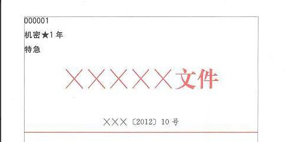
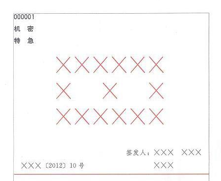

# 公文

## 口诀

__记忆方法__：_两公两决加三通，报请批议函和纪，最后再加令和意_

- 两公：公报，公告。两决：决定，决议。三通：通告，通知，通报。报：报告。请：请示。批：批复。议：议案。函：函。纪；纪要。令：命令。意：意见

## 公文文种

__公告__：_适用于向国内外宣布重要事项或者法定事项。例：我国在东海举行军事演习要向国内外公告_

- 特征：事前行文，没有主送机关，国内外大事，通知范围较大，发文主体级别比较高
  
__公报__：_适用于公布重要决定或者重大事项。例：《中国共产党第十八届中央委员会第一次全体会议公报》_

__决定__：_使用于对重要事项做出决策和部署，奖惩有关单位和人员、变更或者撤销下级不适当的决定事项。例：《中共中央关于深化文化体制改革推动社会主义文化大发展大繁荣若干重大问题的决定》_

- 特征：决策的事项大部分是某一方向，比决议要具体

__决议__：_适用于会议讨论通过的重大决策事项。例：《中国共产党第十八次全国代表大会关于十七届中央委员会报告的决议》_

- 特征：通过会议决定，且决策是事项比较宏观

__通告__：_适用于一定范围内公布应当遵守或者周知的事项。例：《xx电力工业局关于定期借记业务结算方式的通告》_

- 特征：具有专业性，技术性的

__通知__：_适用于发布、传达要求下级机关执行和有关单位周知或者执行的事项，批转、转发公文。例：《财政部教育部关于加强义务教育经费管理的紧急通知》_

- 特征：有主送机关，下行文，要求下级机关执行，周知

__通报__：_适用于表彰先进、批评错误、传达重要精神和告知重要情况。例：《广西壮族自治区人民政府关于柳州市壶东大桥特大交通事故的通报》_

- 特征：通常是低层机关，通报的范围较小

__报告__：_适用于向上级机关汇报工作、反馈情况，回复上级机关的询问。 例：《定远县2014年度依法行政工作报告》_

- 特征：一文多事，无需上级回复

__请示__：_适用于向上级机关请求请示、批准。例：《公安部关于将12月2日设立“全国交通安全日”的请示》_

- 特征：一文一事，通常需要上级及时回复，可以夹带报告。

__批复__：_适用于答复下级机关的请示事项、例：《国务院关于同一设立“全国交通安全日”的请示》_

- 特征：批复下级机关的请示

__议案__：_适用于各级机关政府按照法律程序向同级人大代表或人大常委提出审议事项、例：《国务院关于提请审议中华人民共和国劳动法（草案）的议案》_

- 特征：各级机关政府向同级人大提起审议

__函__：_适用于不相隶属的两个机关进行商洽工作、询问和答复问题、请求批准和答复审批事项。例：《卫生部关于商请做好蜂胶产品监督管理工作的函》_

- 特征：不相隶属的两个机关

__纪要__：_适用于记载会议主要情况和议定事项。例：《关于落实省委领导同志批示保护省级文物七级浮屠塔问题的会议纪要》_

- 特征：会议的高度概括

__命令__：_适用于公布行政法规和规章、宣布施行重大强制性措施，批准授予和晋升衔级、嘉奖有关单位和人员。例：《事业单位会计准则》_

- 特征：强制性、下行文

__意见__：_适用于对重要问题提出见解和处理办法。例：《教育部中央编办财政部人力资源保障部关于加强幼儿园教师队伍建设的意见》_

- 特征：提出见解和处理办法、行文方向不限

_______________

## 公文的分类

__一、按行文方向分类__

（一）上行文：向有隶属关系的上级领导、指导机关报送的公文
（二）下行文：向所属被领导、指导的下级机关发送的公文
（三）平行文：向同一组织系统的同级机关同级机关或非同一组织系统的任何机关发送的公文

__二、按照秘密程度和阅读范围分类__
（一）普通文件：对外公开，限国内公开，内部使用
（二）秘密文件：秘密（保密期限最高10年），机密（保密期限最高20年），绝密（保密期限最高30）。没有注明保密期限默认按最高。

__三、按公文的处理时限分类__
（一）特急公文：不超过24小时
（二）加急公文：不超过72小时
（三）一般公文：不超过15天

__四、按公文的行文方式__
（一）逐级行文：对直属的上级机关或者下级机关制发公文，如果需要，再由上一级或者下一级转发
（二）越级行文：指下属机关越过自己的直接领导机关向更高的领导机关甚至中央或者上级机关直接行文。
（三）多级行文：为了加快公文的传递，在必要时同时向若干个层级的上级机关或下级机关执法公文，包括直达基层组织和向群众公布
（四）直接行文：同级或者不想隶属直接的相互行文时采用。行文不受系统归属与级别层次的制约

## 公文的格式

__版头__

